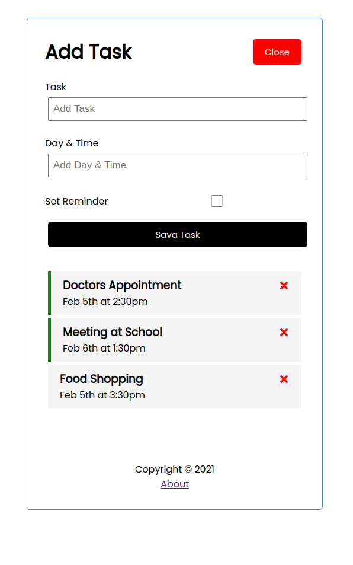
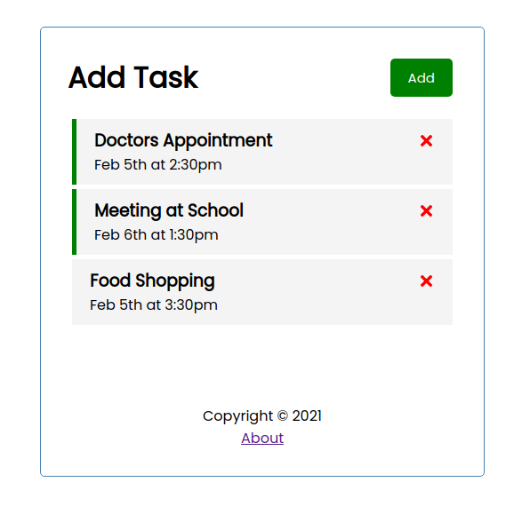

# React / Add Task

<div align="center">





</div>

<h1 align="center">
  Add Task
</h1>

# Usage

Install dependencies

```shell
npm install
```

Run React dev server (http://localhost:3001)

```shell
npm start
```

Run the JSON server (http://localhost:3000)

```shell
npm run server
```

To build for production

```shell
npm run build
```
